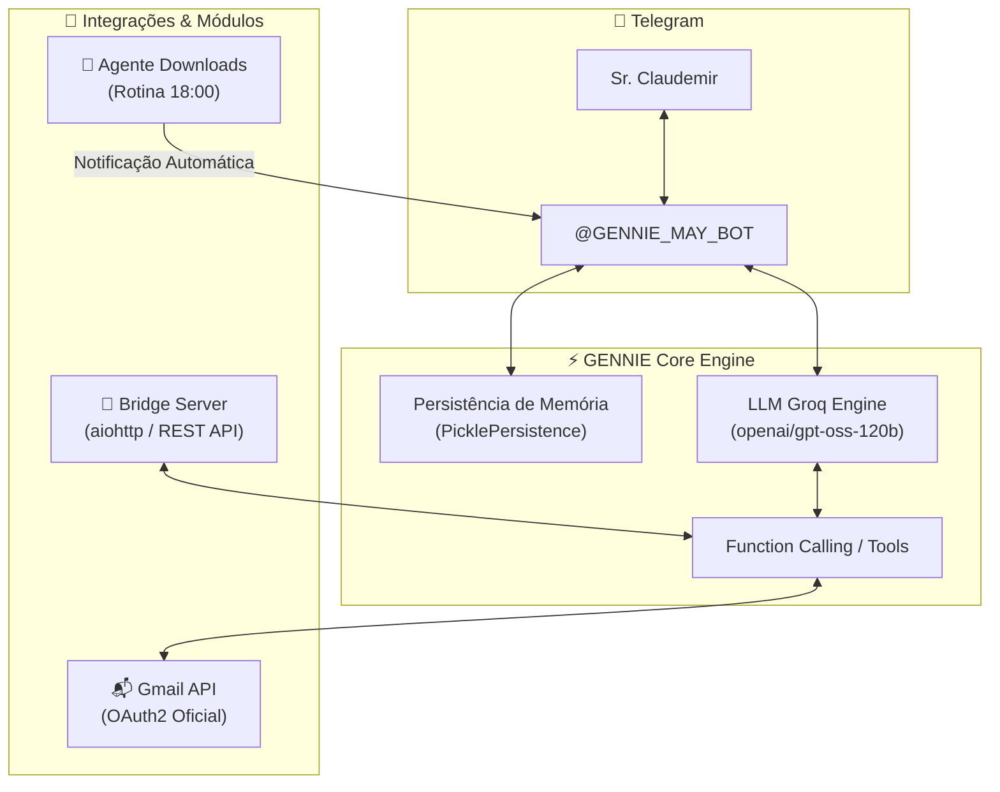

# 🎩 GENNIE BOT — Assistente Pessoal Executiva de Elite & Orquestradora

> **Assistente pessoal inteligente com IA no Telegram, dedicada com exclusividade ao Sr. Claudemir Pedroso Cubas.**  
> Gerencia e-mails (Gmail), supervisiona a higienização da pasta Downloads e disponibiliza API REST assíncrona.

[](https://www.python.org/)
[](https://telegram.org/)
[](https://developers.google.com/gmail/api)
[](https://groq.com/)
[](LICENSE)

---

## 🌟 Visão Geral

O **GENNIE BOT** opera com a postura e a sofisticação de um **mordomo executivo de alta classe (estilo Jarvis)**:
- **Comunicação Cortês & Direta:** Trata o Sr. Claudemir com deferência, clareza métrica e elegância.
- **Segurança Human-in-the-Loop (HITL):** Nenhum e-mail ou resposta é disparado sem que o usuário visualize a prévia no Telegram e forneça autorização explícita (`sim`, `confirmo` ou `cancelar`).
- **Supervisão da Pasta Downloads:** Recebe e formata o relatório diário da rotina agendada das 18:00 do `agente_downloads.py`, comunicando arquivos organizados, duplicatas eliminadas e espaço liberado.
- **Ponte REST:** Expõe endpoints HTTP protegidos por autenticação Bearer para integração com outros sistemas e automações.

---

## 📐 Arquitetura do Sistema



---

## 🚀 Funcionalidades Principais

### 1. 📬 Curadoria e Gestão de E-mails (Gmail)
* **`listar_emails`**: Pesquisa refinada com suporte a queries (`in:inbox`, `is:unread`, `has:attachment`, `filename:pdf`, etc.).
* **`ler_email`**: Leitura decodificada na íntegra com mapeamento de anexos.
* **`gerar_briefing` / `/briefing`**: Análise executiva em lote de e-mails não lidos, destacando panorama, urgências, boletins e sugestões de ação.
* **`resumir_thread`**: Síntese cronológica e contextual de conversas encadeadas completas.
* **`baixar_anexo`**: Download direto e envio do anexo selecionado para o chat do Telegram (`reply_document`).
* **`enviar_email` & `responder_email`**: Criação de mensagens (com ou sem anexos) com trava de confirmação prévia obrigatória.
* **Organização**: `destacar_email` (estrelas), `lixeira_email`, `marcar_spam`, `aplicar_etiqueta`, `marcar_lido` e `arquivar`.

### 2. 🧹 Notificação da Higienização da Pasta Downloads (18:00)
Ao término da tarefa diária agendada no Windows pelo `agente_downloads.py`, a GENNIE entrega um aviso cortês e executivo:
> 🎩 **Relatório de Higienização — Pasta Downloads**  
> *Boa tarde, Sr. Claudemir. A rotina das 18:00 foi concluída com êxito:*  
> 📂 **18 arquivos** organizados por categoria.  
> 🗑️ **4 arquivos duplicados** eliminados.  
> 💾 **142 MB de espaço recuperado** em disco.  
> *Tudo devidamente higienizado e à sua total disposição, senhor.* ✨

### 3. 🌉 Bridge REST Server (API HTTP)
Servidor assíncrono leve em `aiohttp` na porta `8000` para consumo externo:
- `GET /health` — Status da aplicação e da conta.
- `GET /api/v1/status` — Diagnóstico do Gmail e LLM.
- `GET /api/v1/emails/recentes` — Consulta de e-mails via API.
- `GET /api/v1/emails/briefing` — Obtenção do briefing estruturado.
- `POST /api/v1/emails/preparar` — Preparação de rascunhos com prévia HITL.

---

## 💻 Instalação e Configuração

### 1. Clonar o Repositório
```bash
git clone https://github.com/claudemirpc68-del/GENNIE.git
cd GENNIE
```

### 2. Criar Ambiente Virtual e Instalar Dependências
```bash
python -m venv .venv
.venv\Scripts\activate
pip install -r requirements.txt
```

### 3. Configurar Variáveis de Ambiente (`.env`)
Copie o modelo e preencha suas credenciais:
```bash
cp .env.example .env
```
Campos obrigatórios:
```env
TELEGRAM_TOKEN=seu_bot_token_telegram
DONO_ID=seu_telegram_user_id
DEEPSEEK_API_KEY=sua_groq_api_key
DEEPSEEK_MODEL=openai/gpt-oss-120b
DEEPSEEK_URL=https://api.groq.com/openai/v1/chat/completions
BRIDGE_PORT=8000
BRIDGE_SECRET_KEY=sua_chave_secreta_da_ponte
```

### 4. Autorizar o Gmail (OAuth2)
Coloque o arquivo `client_secret.json` na raiz do projeto e execute:
```bash
python autorizar.py
```
Isso gerará o `token.json` autenticado com permissões seguras.

### 5. Executar a GENNIE
```bash
python gennie.py
```

*(Opcional) Para executar também o servidor Bridge REST:*
```bash
python bridge_server.py
```

---

## 🧪 Validação e Testes

Execute a suíte de testes de diagnóstico do ambiente:
```bash
python validar_bot.py
```

---

## 🛡️ Políticas de Segurança e Governança

1. **Acesso Estritamente Exclusivo**: O bot processa comandos exclusivamente vindos do `DONO_ID` autorizado. Qualquer outro ID é sumariamente descartado.
2. **Human-in-the-Loop em E-mails**: Nenhum e-mail sai da caixa postal sem consentimento explícito.
3. **Instância Única (Socket Lock)**: Trava na porta TCP `49876` impedindo instâncias duplicadas concorrentes.
4. **Sem Vazamento de Segredos**: Credenciais, tokens e chaves permanecem restritas ao `.env` e nunca são expostas nos logs.

---

## 📄 Licença
Distribuído sob a Licença MIT. Consulte o arquivo [LICENSE](LICENSE) para mais informações.
