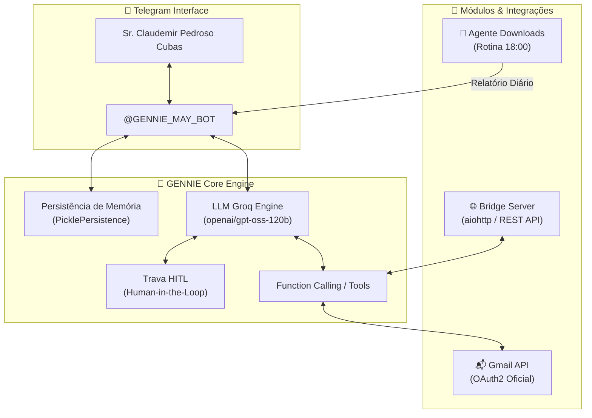

# 🎩 GENNIE BOT — Assistente Pessoal Executiva de Elite

> **Assistente pessoal inteligente com IA no Telegram, dedicada com exclusividade ao Sr. Claudemir Pedroso Cubas.**  
> Opera com a postura e a sofisticação de um mordomo executivo de alta classe (estilo Jarvis), unindo curadoria profunda de e-mails via Gmail API, supervisão da rotina diária de downloads e ponte de integração REST.

[](https://www.python.org/)
[](https://telegram.org/)
[](https://developers.google.com/gmail/api)
[](https://groq.com/)
[](LICENSE)

---

## 🏛️ Postura & Filosofia de Operação

O **GENNIE BOT** opera com a postura e a sofisticação de um **mordomo executivo de alta classe (estilo Jarvis)**:

- **🎩 Comunicação Cortês & Direta:** Trata o Sr. Claudemir com deferência, clareza métrica e elegância.
- **🛡️ Segurança Human-in-the-Loop (HITL):** Nenhum e-mail ou resposta é disparado sem que o usuário visualize a prévia no Telegram e forneça autorização explícita (`sim`, `confirmo` ou `cancelar`).
- **📂 Supervisão da Pasta Downloads:** Recebe e formata o relatório diário da rotina agendada das 18:00 do `agente_downloads.py`, comunicando arquivos organizados, duplicatas eliminadas e espaço liberado.
- **🌐 Ponte REST:** Expõe endpoints HTTP protegidos por autenticação Bearer para integração com outros sistemas e automações.

---

## 🚀 Funcionalidades Principais

### 1. 📬 Curadoria e Gestão de E-mails (Gmail)
- **`listar_emails`**: Pesquisa refinada com suporte a queries (`in:inbox`, `is:unread`, `has:attachment`, `filename:pdf`, etc.).
- **`ler_email`**: Leitura decodificada na íntegra com mapeamento de anexos.
- **`gerar_briefing` / `/briefing`**: Análise executiva em lote de e-mails não lidos, destacando panorama, urgências, boletins e sugestões de ação.
- **`resumir_thread`**: Síntese cronológica e contextual de conversas encadeadas completas.
- **`baixar_anexo`**: Download direto e envio do anexo selecionado para o chat do Telegram (`reply_document`).
- **`enviar_email` & `responder_email`**: Criação de mensagens (com ou sem anexos) com trava de confirmação prévia obrigatória.
- **Organização**: `destacar_email` (estrelas), `lixeira_email`, `marcar_spam`, `aplicar_etiqueta`, `marcar_lido` e `arquivar`.

---

## 🏗️ Arquitetura do Sistema



---

## 💬 Comandos Disponíveis no Telegram

| Comando | Descrição |
| :--- | :--- |
| `/start` | Apresentação executiva da GENNIE e verificação de autorização. |
| `/briefing` | Gera o briefing executivo de e-mails prioritários e não lidos. |
| `/status` | Exibe a saúde das integrações (Gmail, Groq, Memória e Telegram). |
| `/limpar` | Reinicializa o histórico contextual da conversa atual. |
| `/ajuda` | Apresenta o catálogo completo de capacidades e instruções de uso. |

---

## ⚙️ Configuração & Instalação

### 1. Clonar o Repositório
```bash
git clone https://github.com/claudemirpc68-del/GENNIE.git
cd GENNIE
```

### 2. Criar e Ativar Ambiente Virtual
```bash
python -m venv venv
# Windows:
venv\Scripts\activate
# Linux/macOS:
source venv/bin/activate
```

### 3. Instalar Dependências
```bash
pip install -r requirements.txt
```

### 4. Configurar Variáveis de Ambiente (`.env`)
Crie o arquivo `.env` na raiz do projeto com base no modelo:
```env
# Telegram Bot
TELEGRAM_TOKEN=seu_token_aqui
DONO_ID=seu_id_telegram_aqui

# LLM Groq
DEEPSEEK_API_KEY=sua_chave_groq_aqui
DEEPSEEK_MODEL=openai/gpt-oss-120b
DEEPSEEK_URL=https://api.groq.com/openai/v1/chat/completions

# Gmail API
GMAIL_CREDENTIALS_FILE=credentials.json
GMAIL_TOKEN_FILE=token.pickle

# Ponte REST
BRIDGE_PORT=8080
BRIDGE_TOKEN=seu_token_secreto_bearer
```

### 5. Configurar Credenciais do Gmail API
1. Acesse o [Google Cloud Console](https://console.cloud.google.com/).
2. Crie um projeto, ative a **Gmail API** e configure a tela de consentimento OAuth.
3. Crie uma credencial do tipo **Aplicativo para Computador (Desktop)**.
4. Baixe o arquivo JSON e renomeie-o para `credentials.json` na raiz de `GENNIE`.
5. Na primeira execução, será aberta uma janela no navegador para autenticação e geração automática do `token.pickle`.

---

## 🚀 Execução

### Iniciar a GENNIE (Bot Telegram)
```bash
python gennie.py
```

### Iniciar o Bridge Server (API REST)
```bash
python bridge_server.py
```

---

## 🔒 Governança e Segurança

- **Acesso Restrito:** Atendimento filtrado e restrito ao ID do Telegram autorizado (`DONO_ID`).
- **Confirmação Explícita Obrigatória (HITL):** Nenhuma mensagem é transmitida via Gmail sem validação de destinatário, assunto, corpo e anexos aprovados diretamente pelo usuário.
- **Credenciais Isoladas:** Tokens e chaves de acesso são armazenados exclusivamente em variáveis locais (`.env`), sem rastreamento em controle de versão.

---

## 📄 Licença

Distribuído sob a licença **MIT**. Consulte o arquivo [LICENSE](LICENSE) para obter mais informações.
